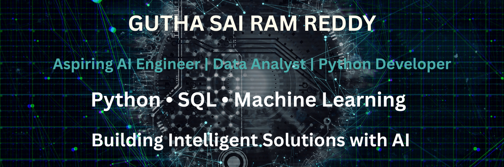

  

# Hi 👋, I'm Gutha Sai Ram Reddy

## 🚀 AI Engineer | Data Analyst | Python Developer

I'm a B.Tech Computer Science (AI & ML) student passionate about Artificial Intelligence, Machine Learning, Data Analytics, and Python Development.

Currently working on real-world FinTech projects and continuously improving my software development and data analysis skills.

---

## 👨‍💻 About Me

- 🎓 B.Tech CSE (AI & ML)
- 🌱 Currently learning Machine Learning, Data Analytics & Streamlit
- 💼 Working on Mutual Fund Analytics Capstone Project
- 🎯 Goal: Become an AI Software Engineer
- ⚡ Interested in AI, Data Science, Python & FinTech

---
## 🛠️ Tech Stack

### Programming Languages

### Data Analytics

### Visualization

### Machine Learning

### Tools

## 🚀 Featured Projects

### 📊 Mutual Fund Analytics Capstone
- Data Ingestion
- Data Cleaning
- SQL Database
- Exploratory Data Analysis
- Interactive Visualizations

### 🤖 AI Burnout Detection
Machine Learning project for detecting employee burnout risk.

### 📒 Contact Book Application
Python CLI application for storing and managing contacts.

---

## 📫 Connect with Me

- 📧 Email: guthasairamreddy99@gmail.com
- 💼 LinkedIn: https://www.linkedin.com/in/gutha-sai-ram-reddy-87a799358

---

⭐ Thank you for visiting my profile!

## 📊 GitHub Statistics

## 🔥 GitHub Streak

## 🏆 GitHub Trophies

## 👀 Profile Visitors

## 💡 Quote

> "The best way to predict the future is to build it." 🚀
